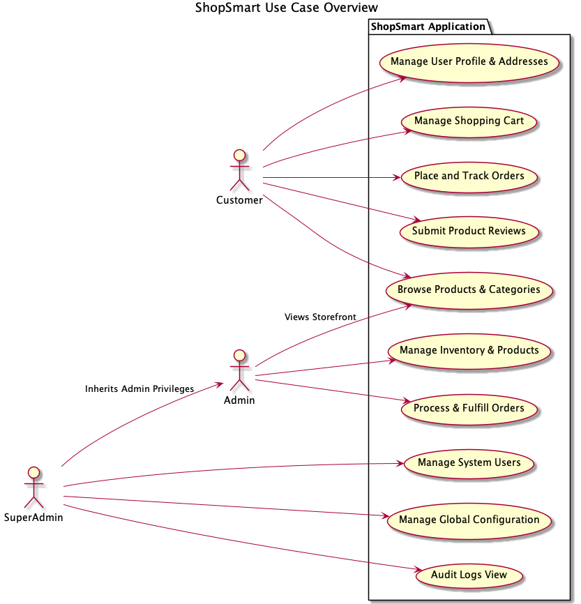
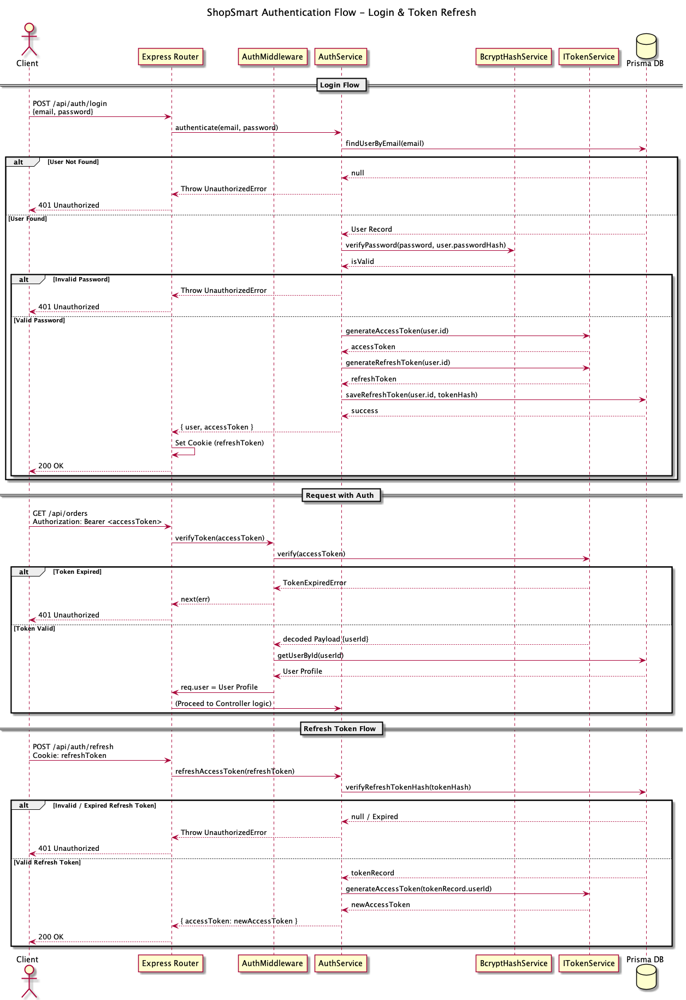
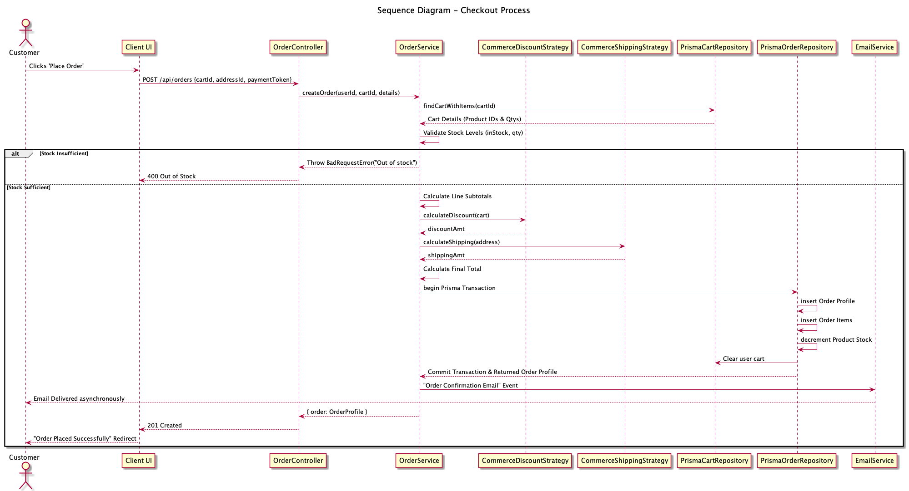
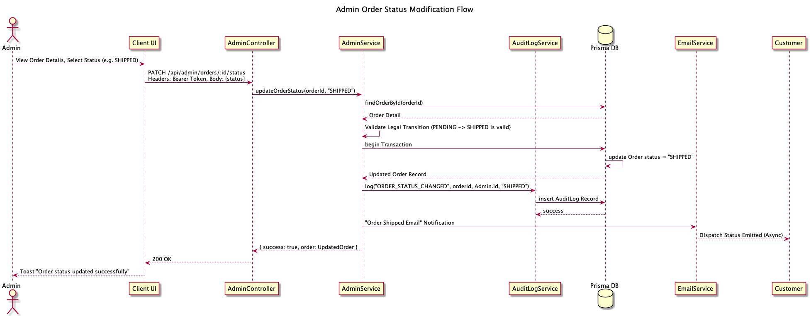
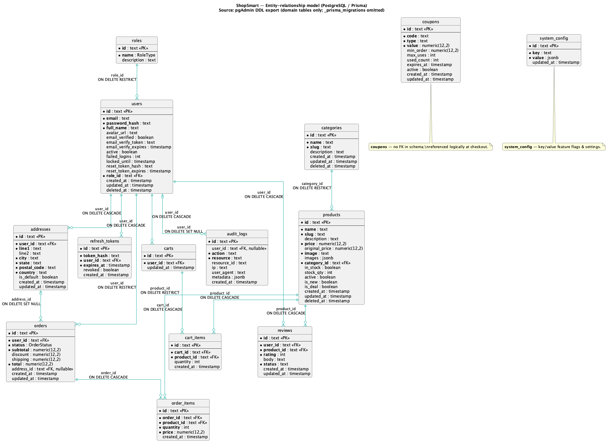
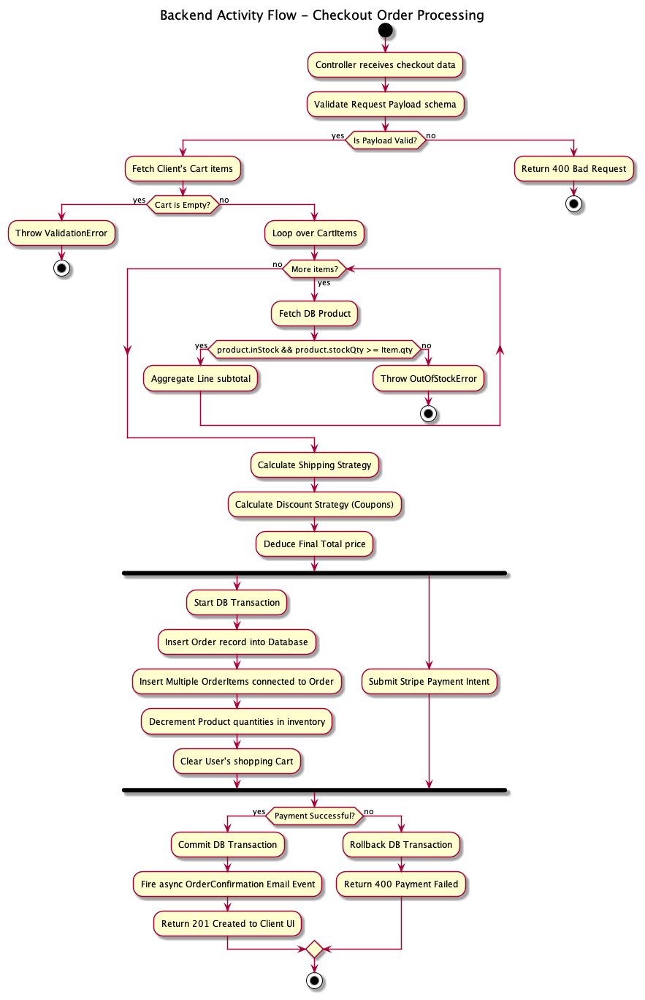
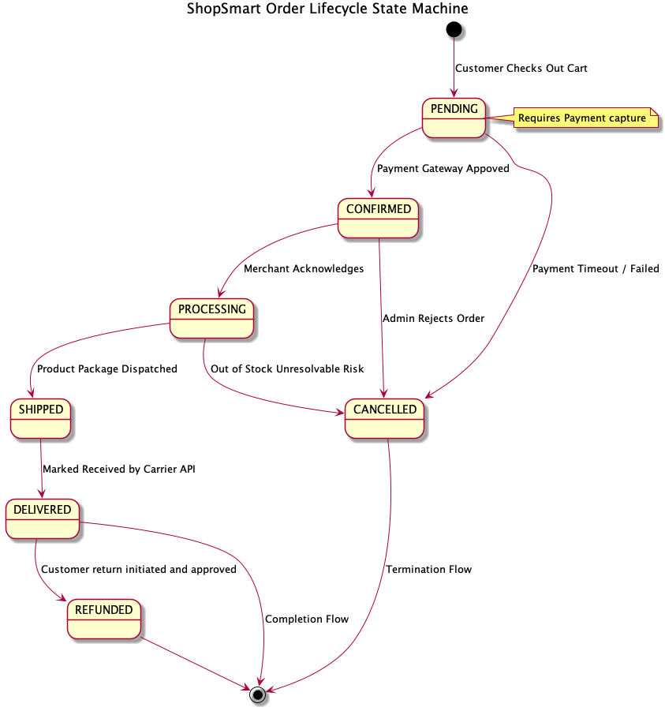

# ShopSmart — Repository Analysis Report

**Repository:** `shop_smart/` (monorepo)  
**Generated:** 2026-04-09  
**Production URLs (per repo docs):**
- **Frontend:** `https://shopsmart.taj.works/`
- **Backend API:** `https://shopsmart-server.taj.works/`
- **Swagger:** `https://shopsmart-swagger.taj.works/api-docs`

---

## 1) Project Overview

### Purpose
ShopSmart is a full‑stack eCommerce platform implemented as a monorepo:
- **Client:** Next.js (App Router) + React + Tailwind UI
- **Server:** Express REST API + Prisma ORM + PostgreSQL
- **Testing:** Jest (unit/integration) + Playwright (E2E)
- **Docs:** Swagger/OpenAPI + UML/ER diagrams

### Problem statement
Modern eCommerce systems must balance:
- **User experience:** fast catalog browsing, clean checkout flow, and responsive admin tooling.
- **Correctness:** consistent order lifecycle rules, stock/cart integrity, and validation.
- **Security:** role-based access for admin/super-admin, safe auth/token handling, and hardened request pipelines.
- **Maintainability:** clear module boundaries and extensibility (pricing/discount/shipping policies, notification channels).

### Key objectives and outcomes
- **Modular backend:** feature slices under `server/src/modules/*` (auth, products, orders, admin, etc.) wired through a composition root (`server/src/container.ts`).
- **Consistent HTTP layer:** controllers follow a shared Template Method (`server/src/base/BaseController.ts`).
- **RBAC enforcement:** middleware-driven authorization gates admin/super-admin APIs (`server/src/middleware/authorize.ts`).
- **Operational readiness:** CI workflows for linting, unit tests, integration tests, and E2E runs (`.github/workflows/*`).
- **Architecture documentation:** Swagger UI plus UML exports in `docs/uml/images/*`.

---

## 2) Team Contributions

### Team members (from Git history)
Top contributors (by commit count) from `git shortlog`:
- **Taj-786** (`tajuddinshaik786r@gmail.com`)
- **Praneeth** (`iampraneeth1116@gmail.com`)
- **ashrith-07** (`ashrith.7j@gmail.com`)
- **omkarhadole / Omkar Hadole** (`omkarhadole38@gmail.com`)
- **Pranavi Mathur / pranavi015** (`mathurpranavi06@gmail.com`)

### Contribution themes (from recent commit messages)
Based on recent commit subjects:
- **Architecture + docs lead:** multiple commits by *Taj-786* around deployment, centralized `architecture.html`, DNS/domains, swagger config, and ER diagram references.
- **UML diagrams:** PR titled “Feature/uml” by *iampraneeth1116* suggests responsibility for UML generation and/or documentation updates.
- **Design patterns documentation:** PR by *ashrith-07* titled “Feature/design patterns”.
- **SOLID refactors / documentation:** commits by *pranavi015* and *Omkar Hadole* referencing SOLID and SRP refactors.

### Collaboration patterns & workflow
- **PR-oriented work:** commit subjects include PR numbers and feature branches, indicating GitHub PR review flow (e.g., “Feature/uml (#9)”).
- **Documentation-first architecture:** several contributions focus on diagrams, ADRs, and architecture pages, suggesting a workflow where documentation is treated as a deliverable alongside code.

> Note: a definitive “who built what feature” mapping requires PR descriptions/issues; the repo history provides strong hints but not full task breakdowns.

---

## 3) System Architecture & Design

### High-level architecture
ShopSmart uses a classic **browser SPA/SSR + REST API + database** topology:
- **Frontend** renders UI (SSR/SSG/client navigation) and calls the API over HTTPS.
- **API** exposes feature modules under `/api/*` and serves Swagger UI under `/api-docs/*`.
- **Persistence** via Prisma ORM to PostgreSQL.

Key server routing entrypoint:
- `server/src/routes/index.ts` mounts modules under `/api/*` and defines `/api/health`.

Composition root / DI:
- `server/src/container.ts` instantiates services and binds middleware dependencies.
- `server/src/factories/ServiceFactory.ts` acts as the **factory + composition** layer (token service selection, notification senders, order commerce strategies).

### UML diagrams (embedded)

#### Use Case Diagram

#### Class Diagram

#### Sequence Diagrams

#### ER Diagrams
The repository contains **two ER visuals**:
- **Provided ER diagram export**:
  
- **DDL-aligned ER (PlantUML)** (generated from the pgAdmin DDL export):
  

#### Component Diagram (system)

#### Deployment Diagram (system)

#### Additional diagrams (useful context)

---

## 4) Codebase Analysis

### Folder structure and organization
Top-level packages:
- `client/`: Next.js frontend (App Router), UI components, context providers, API clients, tests.
- `server/`: Express API + Prisma schema/migrations/seed, module-based routing, middleware, factories, strategies.
- `e2e/`: Playwright test suite and configuration.
- `docs/`: ADRs, ER documentation, UML source (`docs/uml/puml`) and exports (`docs/uml/images`).
- `public/`: Static assets served by the API (e.g., `architecture.html`, `public/uml/*.png`).

### Key server modules & responsibilities
- **Auth** (`server/src/modules/auth/*`): register/login/refresh/logout, password reset, email verification.
- **Products/Categories** (`server/src/modules/products/*`, `server/src/modules/categories/*`): catalog reads and admin CRUD.
- **Cart/Orders** (`server/src/modules/cart/*`, `server/src/modules/orders/*`): cart CRUD and checkout/order lifecycle.
- **Admin/Super-admin** (`server/src/modules/admin/*`, `server/src/modules/super-admin/*`): privileged operations gated by RBAC.

### Key client modules & responsibilities
- **UI system** (`client/components/ui/*`): reusable primitives (e.g., `Button`) using Tailwind + design tokens.
- **Auth context** (`client/context/auth-context.tsx`): session state, refresh-on-mount, route redirects.
- **Route guards** (`client/components/auth/protected-route.tsx`): `ProtectedRoute`, `AdminRoute`, `SuperAdminRoute`.
- **API clients** (`client/api/*.ts`): typed wrappers around Axios (`productApi`, etc.).
- **Shop state** (`client/context/shop-context.tsx`): cart/wishlist state and actions (React context).

### Design patterns used (concrete examples)

#### Backend
- **Template Method (Controller lifecycle)**  
  `server/src/base/BaseController.ts` defines `handleRequest()` which calls `validateRequest()` then `execute()` and standardizes JSON formatting.

- **Factory + Composition Root (DI wiring)**  
  `server/src/factories/ServiceFactory.ts` constructs services (AuthService, OrderService, etc.) from repositories/strategies;  
  `server/src/container.ts` provides the application container and binds auth middleware dependencies.

- **Repository pattern (data access isolation)**  
  Interfaces like `IOrderRepository` are implemented by Prisma repos like `PrismaOrderRepository` (see `server/src/repositories/*` usage in `ServiceFactory`).

- **Strategy pattern (pluggable algorithms)**  
  Token service switches between `JwtTokenService` and `OAuthJwtTokenService` (based on `env.AUTH_PROVIDER`).  
  Commerce strategies (pricing/discount/shipping) are resolved via `resolveOrderCommerceStrategies()` in `server/src/services/registry`.

- **Observer/Event bus (domain events)**  
  `server/src/events/EventBus.ts` provides a singleton event bus used by services (e.g., order status events in `server/src/modules/orders/orders.service.ts`).

#### Client
- **Provider pattern (React Context)**  
  `client/context/auth-context.tsx` and `client/context/shop-context.tsx` expose state + actions through context providers.

- **Guard/Policy pattern (RBAC in UI)**  
  `client/components/auth/protected-route.tsx` computes “allowed” based on required roles and redirects accordingly.

### Clean code practices (high signal)
- **Typed boundaries:** DTO-like types in client API wrappers; interfaces in server isolate DB and strategy implementations.
- **Separation of concerns:** controllers orchestrate HTTP; services enforce domain rules; repositories handle persistence.
- **Validation + standardized errors:** request validation middleware exists; `AppErrorFactory` is used for consistent error modeling.

---

## 5) SOLID Principles & Best Practices (with concrete evidence)

### S — Single Responsibility Principle
- **Controllers** focus on HTTP-level concerns (status, JSON response), delegating business logic to services:  
  `server/src/modules/products/products.controller.ts`.
- **OrderService** focuses on order orchestration and event emission, delegating pricing/discount/shipping to strategies:  
  `server/src/modules/orders/orders.service.ts`.

### O — Open/Closed Principle
- Token service selection is extension-friendly: new token strategies can be added without changing AuthService by updating the factory resolver:  
  `server/src/factories/ServiceFactory.ts` (`resolveTokenService()`).

### L — Liskov Substitution Principle
- Controllers are substitutable by design: any subclass implementing `execute()` satisfies `BaseController` contract:  
  `server/src/base/BaseController.ts`.

### I — Interface Segregation Principle
- Server code uses smaller interfaces instead of “god interfaces”: examples include `IOrderRepository`, `IOrderPricingStrategy`, `IDiscountStrategy`, `IShippingStrategy` used by `OrderService`:  
  `server/src/modules/orders/orders.service.ts`.

### D — Dependency Inversion Principle
- High-level services depend on abstractions (interfaces) while concrete Prisma repositories are bound in the factory/container:  
  `server/src/factories/ServiceFactory.ts` and `server/src/container.ts`.

---

## 6) Database Design

### Schema summary
Persistence is modeled with Prisma and mapped to PostgreSQL tables:
- **Auth & identity:** `users`, `roles`, `refresh_tokens`
- **Commerce:** `categories`, `products`, `carts`, `cart_items`, `orders`, `order_items`, `reviews`
- **Operational:** `audit_logs`, `system_config`, `coupons`

Prisma schema source:
- `server/prisma/schema.prisma`

### Relationships & constraints (highlights)
From the DDL / Prisma model mapping:
- `roles (1) → (many) users` via `users.role_id`.
- `users (1) → (many) refresh_tokens`, `addresses`, `orders`, `reviews`.
- `carts (1) → (many) cart_items`; `products (1) → (many) cart_items`.
- `orders (1) → (many) order_items`; `products (1) → (many) order_items`.
- Optional `orders.address_id` (nullable FK).

### ER diagram (embedded)

---

## 7) DevOps & Deployment

### Hosting platform and deployment strategy
- Monorepo supports separate deploys for `client/` and `server/`.
- Swagger/OpenAPI is served from the API app (`/api-docs`) and may also be hosted on a dedicated docs domain.

Vercel function routing for the API is configured in:
- `server/vercel.json` (catch-all rewrite to `api/index.ts`).

### Domain configuration details
Per repo documentation:
- `shopsmart.taj.works` (frontend)
- `shopsmart-server.taj.works` (API)
- `shopsmart-swagger.taj.works` (Swagger UI)

### DNS provider and setup
DNS provider details are typically managed outside source control. The repo documents the **resulting domains**, but not the registrar/DNS vendor. Record types and certificate issuance are therefore out-of-scope for “code-only” evidence.

### CI/CD pipeline (GitHub Actions)
Workflows under `.github/workflows/`:
- **Lint:** `lint.yml` (client + server ESLint)
- **Unit tests:** `unit-tests.yml` (server + client)
- **Integration tests:** `integration-tests.yml` (server integration)
- **E2E:** `e2e-tests.yml` (build both packages, start them, run Playwright)

### Environment configuration handling
- CI uses a `DOTENV` secret to write `.env` files for server/client (see workflows).
- Runtime uses conventional env variables (e.g., DB URL, JWT secrets, SMTP config, `FRONTEND_URL` for CORS).

---

## 8) Scalability & Performance

### Horizontal scaling
The server is designed to be **stateless** (critical for scaling):
- Token verification is performed per request; refresh tokens are persisted server-side.
- Business logic is centralized in services; no sticky-session requirement at the app layer.

### Load handling and optimization techniques
- **Rate limiting** is enabled in the Express app (`express-rate-limit`) to reduce abuse load.
- **DB indexes** exist on common access paths (e.g., orders by `user_id`, products by `category_id`, refresh token by `user_id`/`token_hash`).
- Prisma usage encourages consistent query patterns and reduces SQL injection risks via parameterized queries.

### Caching mechanisms
Current repo evidence indicates:
- **HTTP caching headers** for certain static assets/pages (e.g., Swagger icon, architecture page) set by the API server.
- No Redis layer is present in dependencies; caching is primarily **edge/static** rather than in-memory distributed cache.

---

## 9) Security Considerations

### Authentication & authorization
- API supports Bearer token auth and (in parts of the repo) cookie-based sessions; authorization is role-based:
  - `server/src/middleware/authenticate.ts`
  - `server/src/middleware/authorize.ts`

Client RBAC mirrors server RBAC with route guards:
- `client/components/auth/protected-route.tsx`

### Secrets management
- `.env` is used locally; CI uses encrypted secrets (`DOTENV`).
- Sensitive values should remain out of Git: `DATABASE_URL`, `JWT_*_SECRET`, SMTP credentials, etc.

### Vulnerabilities & improvements
- **Token storage consistency:** The repo contains `client/lib/auth-storage.ts` (localStorage helpers) while the active Axios/auth-context paths show cookie credentials. Standardize one approach to reduce security and maintenance risk.
- **XSS hardening (if using localStorage):** add CSP, strict content sanitization; avoid storing refresh tokens in localStorage if not required.
- **Swagger on serverless:** ensure Swagger static assets are bundled in serverless deployments (addressed via Vercel `includeFiles`).

---

## 10) Future Enhancements

### Feature roadmap suggestions
- **Unified auth contract:** choose one client session strategy (cookie or Bearer) and align Swagger, docs, and client APIs.
- **Coupon application wiring:** coupons exist as a table; connect coupon validation to checkout pricing pipeline.
- **Observability:** structured request logging + trace IDs; audit log enrichment for admin actions.

### Technical debt / refactoring opportunities
- **Reduce drift between docs and implementation:** keep README/architecture page in sync with actual auth behavior.
- **Centralize API response types:** unify `{ success, data }` vs `{ success, user }` patterns for predictability.

---

## 11) Conclusion

### Strengths
- Clear modular backend with strong separation: routes/controllers/services/repositories.
- Explicit extensibility via strategies and factories.
- Strong documentation footprint: ADRs + Swagger + UML exports + architecture page.
- CI coverage across unit, integration, and E2E.

### Key takeaways
ShopSmart demonstrates a production-style architecture with clean layering and extensibility points. The biggest engineering risk is **configuration/contract drift** between environments and documentation (especially around auth/session transport). Standardizing those contracts and tightening deployment bundling/caching details will keep the system reliable as it scales.

