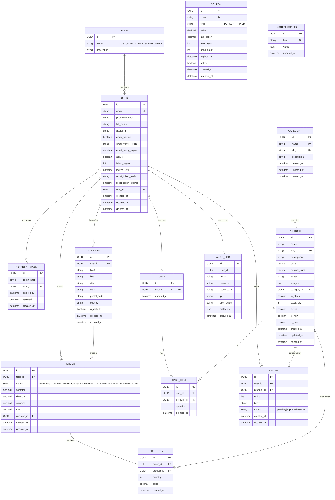

# ShopSmart — Entity Relationship Diagram

> Rendered with **Mermaid** (`erDiagram`). Open in any Mermaid-compatible viewer (e.g. VS Code Mermaid Preview, GitHub, draw.io import).

## ER Diagram

---

## Entity ↔ Prisma Model ↔ Table Mapping

| ER Entity | Prisma Model | DB Table (`@@map`) |
|-----------|-------------|-------------------|
| USER | `User` | `users` |
| ROLE | `Role` | `roles` |
| REFRESH_TOKEN | `RefreshToken` | `refresh_tokens` |
| CATEGORY | `Category` | `categories` |
| PRODUCT | `Product` | `products` |
| ADDRESS | `Address` | `addresses` |
| ORDER | `Order` | `orders` |
| ORDER_ITEM | `OrderItem` | `order_items` |
| CART | `Cart` | `carts` |
| CART_ITEM | `CartItem` | `cart_items` |
| REVIEW | `Review` | `reviews` |
| AUDIT_LOG | `AuditLog` | `audit_logs` |
| COUPON | `Coupon` | `coupons` |
| SYSTEM_CONFIG | `SystemConfig` | `system_config` |

---

## Key Design Notes

- **Soft Deletes**: `User`, `Product`, `Category` use `deleted_at` (nullable) — records are never hard deleted in normal operation.
- **One Cart per User**: `cart.user_id` has a `@unique` constraint — each user has exactly one cart.
- **Cascade Deletes**: `RefreshToken`, `Cart`, `CartItem`, `Address`, `Review` cascade-delete when the parent `User` or `Cart` is deleted.
- **Order Immutability**: `OrderItem.price` is stored at the time of order — not linked live to `Product.price` — preventing price drift.
- **Role Enum**: `CUSTOMER`, `ADMIN`, `SUPER_ADMIN` stored in the `roles` table and referenced by FK from `users`.
- **Coupon**: Standalone entity — not FK-linked to `Order` in schema (applied at checkout, discount recorded in `Order.discount`).
- **AuditLog**: `userId` is nullable — allows logging system-level actions with no user context.
