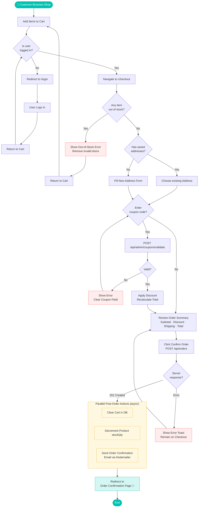

# ShopSmart — Activity Diagram: Customer Checkout Flow

> Mermaid flowchart with swim lanes simulated via subgraphs.

```mermaid
flowchart TD
    Start([🛒 Customer Browses Shop]) --> AddCart[Add Items to Cart]
    AddCart --> CheckLogin{Is user\nlogged in?}

    CheckLogin -- No --> GoLogin[Redirect to /login]
    GoLogin --> Login[User Logs In]
    Login --> ReturnCart[Return to Cart]
    ReturnCart --> CheckLogin

    CheckLogin -- Yes --> GoCheckout[Navigate to /checkout]

    GoCheckout --> ValidateStock{Any item\nout of stock?}
    ValidateStock -- Yes --> ShowStockErr[Show Out-of-Stock Error\nRemove invalid items]
    ShowStockErr --> BackToCart[Return to Cart]
    BackToCart --> AddCart

    ValidateStock -- No --> LoadAddr{Has saved\naddresses?}

    LoadAddr -- Yes --> SelectAddr[Choose existing Address]
    LoadAddr -- No --> AddAddr[Fill New Address Form]
    SelectAddr --> CouponQ
    AddAddr --> CouponQ

    CouponQ{Enter\ncoupon code?}
    CouponQ -- No --> ReviewSummary
    CouponQ -- Yes --> ValidateCoupon[POST /api/admin/coupons/validate]

    ValidateCoupon --> CouponValid{Valid?}
    CouponValid -- No --> CouponErr[Show Error\nClear Coupon Field]
    CouponErr --> CouponQ
    CouponValid -- Yes --> ApplyDiscount[Apply Discount\nRecalculate Total]
    ApplyDiscount --> ReviewSummary

    ReviewSummary[Review Order Summary\nSubtotal · Discount · Shipping · Total]
    ReviewSummary --> ConfirmOrder[Click Confirm Order\nPOST /api/orders]

    ConfirmOrder --> ServerResp{Server\nresponse?}

    ServerResp -- "201 Created" --> Parallel1

    subgraph Parallel1 ["Parallel Post-Order Actions (async)"]
        direction LR
        ClearCart[Clear Cart in DB] 
        DecrStock[Decrement Product stockQty]
        SendEmail[Send Order Confirmation\nEmail via Nodemailer]
    end

    Parallel1 --> OrderConfirmPage[Redirect to\nOrder Confirmation Page 🎉]
    OrderConfirmPage --> End([End])

    ServerResp -- Error --> ShowError[Show Error Toast\nRemain on Checkout]
    ShowError --> ReviewSummary

    style Start fill:#00C2B2,color:#fff,stroke:none
    style End fill:#00C2B2,color:#fff,stroke:none
    style OrderConfirmPage fill:#d4f7f4,stroke:#00C2B2
    style ShowStockErr fill:#ffecec,stroke:#ff6b6b
    style CouponErr fill:#ffecec,stroke:#ff6b6b
    style ShowError fill:#ffecec,stroke:#ff6b6b
    style Parallel1 fill:#fff8e1,stroke:#f0b429
    style ClearCart fill:#fff8e1,stroke:#f0b429
    style DecrStock fill:#fff8e1,stroke:#f0b429
    style SendEmail fill:#fff8e1,stroke:#f0b429
```
