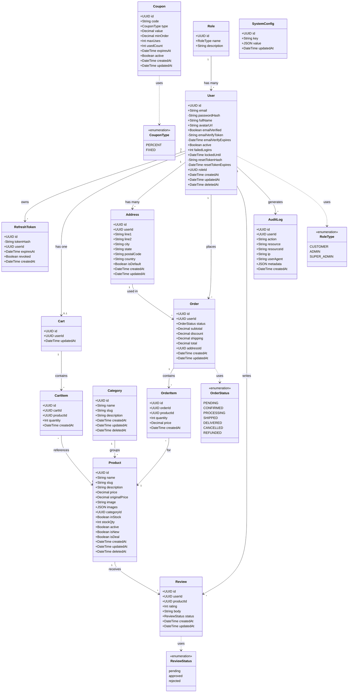

# ShopSmart — Class Diagram

> Mermaid class diagram based on `server/prisma/schema.prisma`.

```mermaid
classDiagram

    %% ─── Enumerations ───
    class RoleType {
        <<enumeration>>
        CUSTOMER
        ADMIN
        SUPER_ADMIN
    }

    class OrderStatus {
        <<enumeration>>
        PENDING
        CONFIRMED
        PROCESSING
        SHIPPED
        DELIVERED
        CANCELLED
        REFUNDED
    }

    class ReviewStatus {
        <<enumeration>>
        pending
        approved
        rejected
    }

    class CouponType {
        <<enumeration>>
        PERCENT
        FIXED
    }

    %% ─── Role ───
    class Role {
        +UUID id
        +RoleType name
        +String description
    }

    %% ─── User ───
    class User {
        +UUID id
        +String email
        -String passwordHash
        +String fullName
        +String avatarUrl
        +Boolean emailVerified
        -String emailVerifyToken
        -DateTime emailVerifyExpires
        +Boolean active
        +Int failedLogins
        +DateTime lockedUntil
        -String resetTokenHash
        -DateTime resetTokenExpires
        +UUID roleId
        +DateTime createdAt
        +DateTime updatedAt
        +DateTime deletedAt
    }

    %% ─── RefreshToken ───
    class RefreshToken {
        +UUID id
        -String tokenHash
        +UUID userId
        +DateTime expiresAt
        +Boolean revoked
        +DateTime createdAt
    }

    %% ─── Category ───
    class Category {
        +UUID id
        +String name
        +String slug
        +String description
        +DateTime createdAt
        +DateTime updatedAt
        +DateTime deletedAt
    }

    %% ─── Product ───
    class Product {
        +UUID id
        +String name
        +String slug
        +String description
        +Decimal price
        +Decimal originalPrice
        +String image
        +JSON images
        +UUID categoryId
        +Boolean inStock
        +Int stockQty
        +Boolean active
        +Boolean isNew
        +Boolean isDeal
        +DateTime createdAt
        +DateTime updatedAt
        +DateTime deletedAt
    }

    %% ─── Address ───
    class Address {
        +UUID id
        +UUID userId
        +String line1
        +String line2
        +String city
        +String state
        +String postalCode
        +String country
        +Boolean isDefault
        +DateTime createdAt
        +DateTime updatedAt
    }

    %% ─── Order ───
    class Order {
        +UUID id
        +UUID userId
        +OrderStatus status
        +Decimal subtotal
        +Decimal discount
        +Decimal shipping
        +Decimal total
        +UUID addressId
        +DateTime createdAt
        +DateTime updatedAt
    }

    %% ─── OrderItem ───
    class OrderItem {
        +UUID id
        +UUID orderId
        +UUID productId
        +Int quantity
        +Decimal price
        +DateTime createdAt
    }

    %% ─── Cart ───
    class Cart {
        +UUID id
        +UUID userId
        +DateTime updatedAt
    }

    %% ─── CartItem ───
    class CartItem {
        +UUID id
        +UUID cartId
        +UUID productId
        +Int quantity
        +DateTime createdAt
    }

    %% ─── Review ───
    class Review {
        +UUID id
        +UUID userId
        +UUID productId
        +Int rating
        +String body
        +ReviewStatus status
        +DateTime createdAt
        +DateTime updatedAt
    }

    %% ─── AuditLog ───
    class AuditLog {
        +UUID id
        +UUID userId
        +String action
        +String resource
        +String resourceId
        +String ip
        +String userAgent
        +JSON metadata
        +DateTime createdAt
    }

    %% ─── Coupon ───
    class Coupon {
        +UUID id
        +String code
        +CouponType type
        +Decimal value
        +Decimal minOrder
        +Int maxUses
        +Int usedCount
        +DateTime expiresAt
        +Boolean active
        +DateTime createdAt
        +DateTime updatedAt
    }

    %% ─── SystemConfig ───
    class SystemConfig {
        +UUID id
        +String key
        +JSON value
        +DateTime updatedAt
    }

    %% ─── Relationships ───
    Role         "1" --> "*" User           : has many
    User         "1" --> "*" RefreshToken   : owns
    User         "1" --> "0..1" Cart        : has one
    User         "1" --> "*" Address        : has many
    User         "1" --> "*" Order          : places
    User         "1" --> "*" Review         : writes
    User         "1" --> "*" AuditLog       : generates
    Category     "1" --> "*" Product        : groups
    Cart         "1" --> "*" CartItem       : contains
    CartItem     "*" --> "1" Product        : references
    Order        "1" --> "*" OrderItem      : contains
    OrderItem    "*" --> "1" Product        : for
    Address      "1" --> "*" Order          : used in
    Product      "1" --> "*" Review         : receives
    User         ..>  RoleType              : uses
    Order        ..>  OrderStatus           : uses
    Review       ..>  ReviewStatus          : uses
    Coupon       ..>  CouponType            : uses
```
