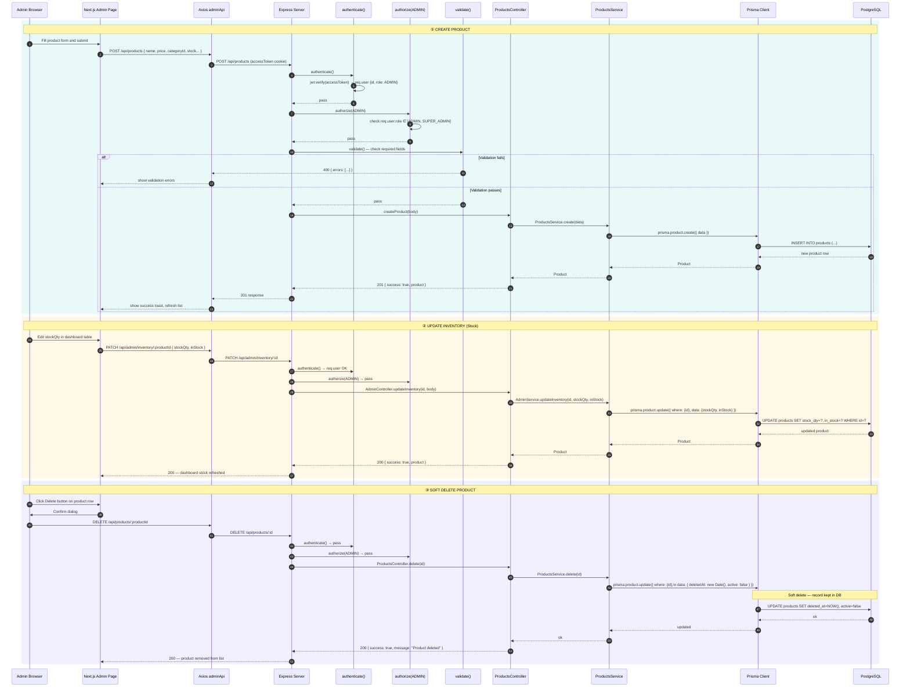

# ShopSmart — Sequence Diagram: Admin Product Management

> Covers **Create Product → Update Inventory → Soft Delete**.

```mermaid
sequenceDiagram
    autonumber
    participant AB  as Admin Browser
    participant NP  as Next.js Admin Page
    participant AX  as Axios adminApi
    participant EX  as Express Server
    participant AU  as authenticate()
    participant AZ  as authorize(ADMIN)
    participant VA  as validate()
    participant PC  as ProductsController
    participant PS  as ProductsService
    participant PRI as Prisma Client
    participant DB  as PostgreSQL

    %% ══════════════════════════════════════════
    rect rgb(232, 249, 247)
        Note over AB,DB: ① CREATE PRODUCT
        AB->>NP: Fill product form and submit
        NP->>AX: POST /api/products { name, price, categoryId, stock... }
        AX->>EX: POST /api/products (accessToken cookie)
        EX->>AU: authenticate()
        AU->>AU: jwt.verify(accessToken) → req.user {id, role: ADMIN}
        AU-->>EX: pass
        EX->>AZ: authorize(ADMIN)
        AZ->>AZ: check req.user.role ∈ [ADMIN, SUPER_ADMIN]
        AZ-->>EX: pass
        EX->>VA: validate() — check required fields
        alt Validation fails
            VA-->>AX: 400 { errors: [...] }
            AX-->>NP: show validation errors
        else Validation passes
            VA-->>EX: pass
            EX->>PC: createProduct(body)
            PC->>PS: ProductsService.create(data)
            PS->>PRI: prisma.product.create({ data })
            PRI->>DB: INSERT INTO products (...)
            DB-->>PRI: new product row
            PRI-->>PS: Product
            PS-->>PC: Product
            PC-->>EX: 201 { success: true, product }
            EX-->>AX: 201 response
            AX-->>NP: show success toast, refresh list
        end
    end

    %% ══════════════════════════════════════════
    rect rgb(255, 248, 230)
        Note over AB,DB: ② UPDATE INVENTORY (Stock)
        AB->>NP: Edit stockQty in dashboard table
        NP->>AX: PATCH /api/admin/inventory/:productId { stockQty, inStock }
        AX->>EX: PATCH /api/admin/inventory/:id
        EX->>AU: authenticate() → req.user OK
        EX->>AZ: authorize(ADMIN) → pass
        EX->>PC: AdminController.updateInventory(id, body)
        PC->>PS: AdminService.updateInventory(id, stockQty, inStock)
        PS->>PRI: prisma.product.update({ where: {id}, data: {stockQty, inStock} })
        PRI->>DB: UPDATE products SET stock_qty=?, in_stock=? WHERE id=?
        DB-->>PRI: updated product
        PRI-->>PS: Product
        PS-->>PC: Product
        PC-->>EX: 200 { success: true, product }
        EX-->>NP: 200 — dashboard stock refreshed
    end

    %% ══════════════════════════════════════════
    rect rgb(240, 240, 255)
        Note over AB,DB: ③ SOFT DELETE PRODUCT
        AB->>NP: Click Delete button on product row
        NP->>AB: Confirm dialog
        AB->>AX: DELETE /api/products/:productId
        AX->>EX: DELETE /api/products/:id
        EX->>AU: authenticate() → pass
        EX->>AZ: authorize(ADMIN) → pass
        EX->>PC: ProductsController.delete(id)
        PC->>PS: ProductsService.delete(id)
        PS->>PRI: prisma.product.update({ where: {id},\n  data: { deletedAt: new Date(), active: false } })
        Note over PRI,DB: Soft delete — record kept in DB
        PRI->>DB: UPDATE products SET deleted_at=NOW(), active=false
        DB-->>PRI: ok
        PRI-->>PS: updated
        PS-->>PC: ok
        PC-->>EX: 200 { success: true, message: "Product deleted" }
        EX-->>NP: 200 — product removed from list
    end
```
