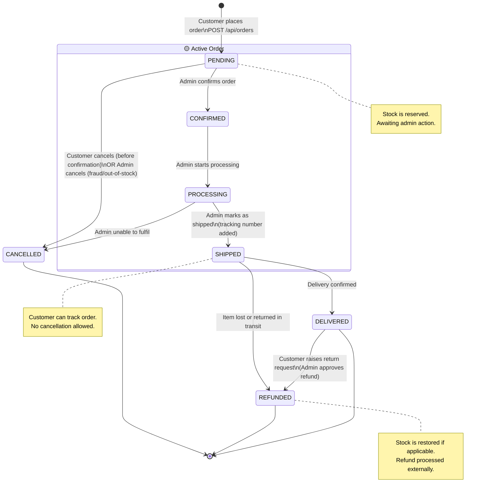

# ShopSmart — State Diagram: Order Lifecycle

> Order status transitions from placement through delivery or cancellation.

---

## Transition Table

| From | To | Trigger | Actor |
|------|----|---------|-------|
| — | PENDING | Customer places order | Customer |
| PENDING | CONFIRMED | Admin confirms | Admin |
| PENDING | CANCELLED | Customer or Admin cancels | Customer / Admin |
| CONFIRMED | PROCESSING | Admin starts processing | Admin |
| PROCESSING | SHIPPED | Admin marks shipped | Admin |
| PROCESSING | CANCELLED | Admin unable to fulfil | Admin |
| SHIPPED | DELIVERED | Delivery confirmed | Admin / System |
| SHIPPED | REFUNDED | Lost/returned in transit | Admin |
| DELIVERED | REFUNDED | Return approved | Admin |
| CANCELLED | — | Terminal state | — |
| REFUNDED | — | Terminal state | — |
| DELIVERED | — | Terminal state | — |
